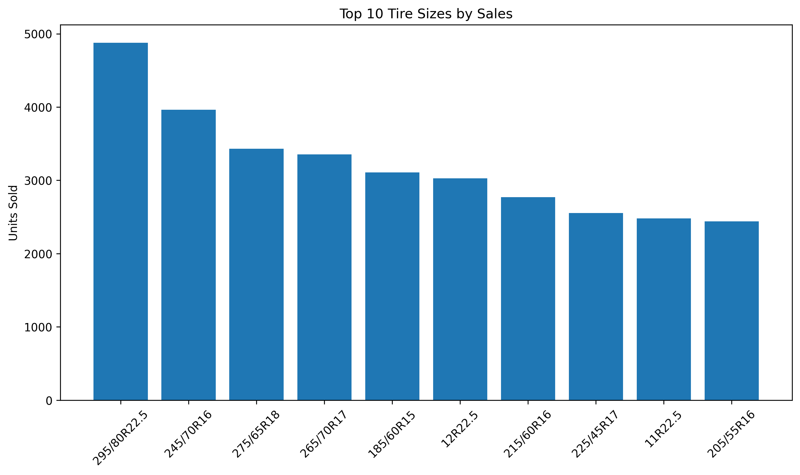
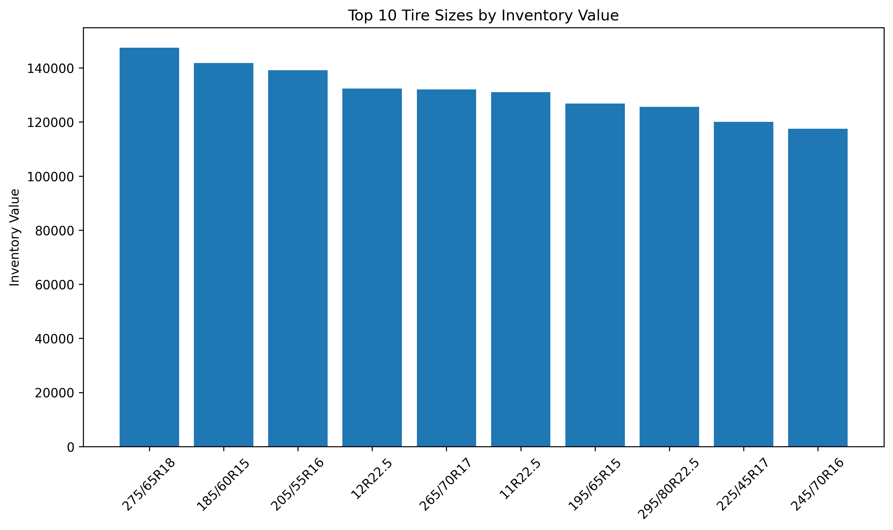
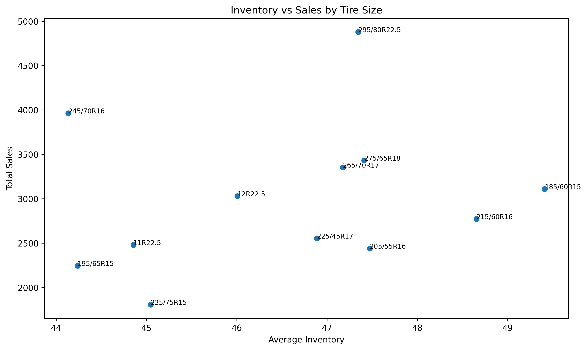
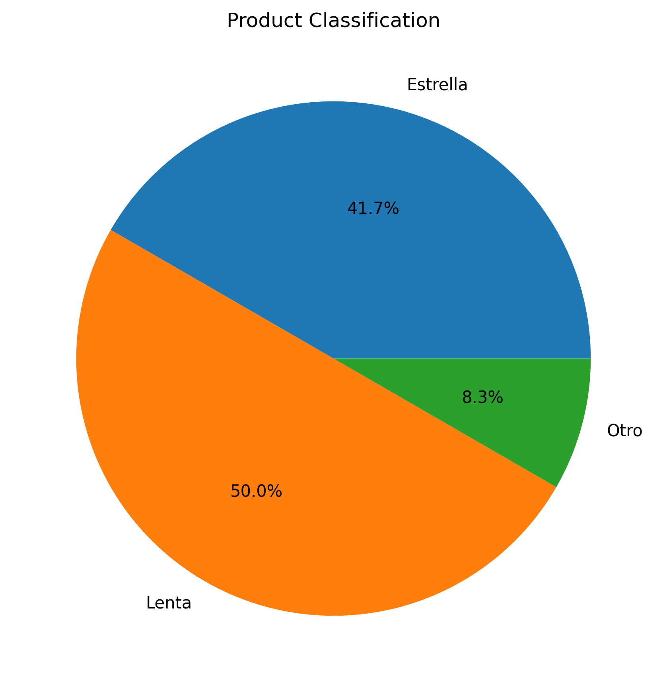

# 🚛 New Tyres Inventory Analytics
---

Inventory optimization and product performance analysis using Python and data visualization.


## 📌 Project Overview

This project analyzes inventory and sales performance for a tire distribution business.

The objective was to identify high-performing products, inventory risks, and opportunities to optimize purchasing decisions through data analysis.

The analysis was conducted using a simulated dataset representing 90 days of inventory activity across multiple tire products.

---
## 📓 Project Notebook

The complete analysis can be found in:

- notebooks/NewTyres_Inventory_Analytics.ipynb

---
## 🎯 Business Problem

Inventory management is a critical challenge for tire distributors.

Excess inventory ties up capital, while insufficient inventory can result in missed sales opportunities.

This project aims to identify:

- Top-selling tire sizes
- Products with the highest inventory investment
- Product rotation patterns
- Opportunities to improve purchasing decisions

---

## 📊 Dataset

The dataset contains:

- 18,000 inventory records
- 200 tire products
- 12 tire size categories
- Sales information
- Inventory levels
- Product costs

The data was generated for educational and portfolio purposes.

---

## 🛠 Tools Used

- Python
- Pandas
- NumPy
- Matplotlib
- Google Colab
- GitHub

---
## 📂 Project Structure

```text
new-tyres-inventory-analytics

├── data
├── images
├── notebooks
├── presentation
└── README.md
```

## 🔄 Analysis Process

### Data Preparation

- Loaded inventory and sales datasets
- Reviewed data structure and quality

### KPI Development

Calculated:

- Total Sales
- Average Inventory
- Inventory Turnover
- Inventory Value

### Product Classification

Products were categorized as:

- ⭐ Star Products
- 🐢 Slow-Moving Products
- ⚪ Other

---

## 📈 Visualizations

### Top Selling Tire Sizes



### Inventory Value by Tire Size



### Inventory vs Sales



### Product Classification



---

## 🔍 Key Findings

- Total sales reached **36,058 units** during the analysis period.
- Average inventory levels remained at **46.65 units per product**.
- Tire size **295/80R22.5** generated the highest sales volume and inventory turnover.
- Tire size **275/65R18** represented the largest inventory investment.
- The top three tire sizes generated approximately **34% of total sales**.
- Five tire sizes were classified as Star Products.
- Six tire sizes were classified as Slow-Moving Products.

---

## 💡 Recommendations

### 1. Prioritize High-Performing Products

Maintain adequate inventory levels for high-demand products such as 295/80R22.5.

### 2. Monitor Inventory Investment

Review inventory levels for 275/65R18 due to its high inventory value.

### 3. Reduce Excess Inventory

Evaluate purchasing frequency for slow-moving products.

### 4. Support Data-Driven Decisions

Use inventory analytics to improve purchasing and replenishment planning.

---

## 🚀 Future Improvements

Future versions of this project may include:

- Real inventory data integration
- Automated inventory update pipelines
- Demand forecasting models
- Interactive dashboards
- Purchase recommendation systems

---

## 👩‍💻 About the Author

**Georgina Casas**

Aspiring Data Analyst currently completing the Google Data Analytics Professional Certificate.

Interested in:

- Data Analytics
- Business Intelligence
- Inventory Optimization
- Data Visualization
